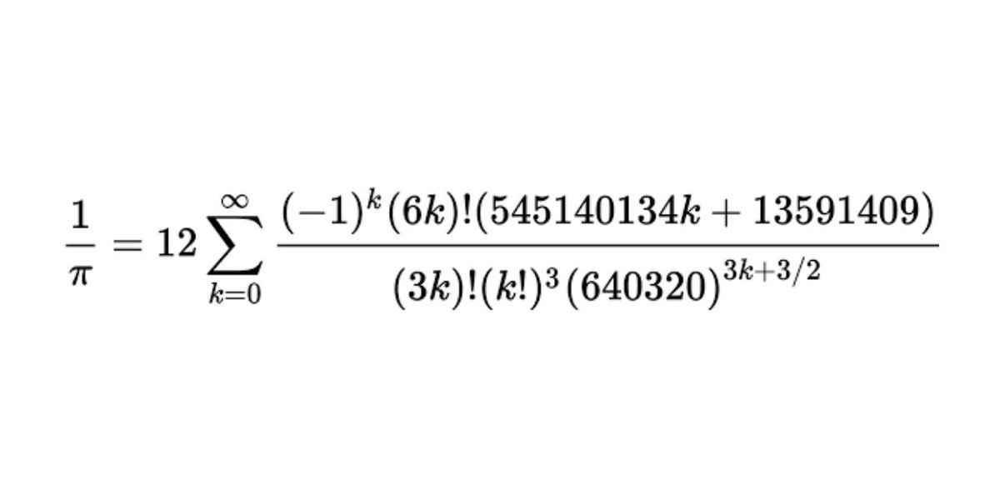

# Find PI to the Nth Digit
Have the user enter a number 'n' and print out pi to the 'nth' digit,i.e. to the number
of decimal places. Keep a limit of how far the program will go.

## Problem Overview and Solution Set-Up
* `round().` only works up to 15 decimal points
* The Float datatype has a limit on how precise you can get; instead I used a `Decimal` to represent numbers with such precision.
* Chudnovsky Algorithim is a fast method for calculating the digits of pi, based on Ramanujan's pi formulae.



* pi
* k: 0 to infinity

## Libraries used
```
from math import factorial
from decimal import Decimal,getcontext
```
